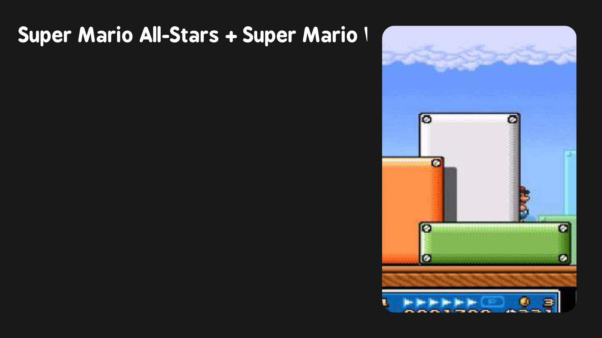

# MinUI-ish
A super simple emulationstation. Based on the MinUI CFW

## Table of Contents:
- Introduction
- Features
- Compatiblity
- Usage
- Screenshots
- Contributing

## Introduction:
MinUI-ish is a super barebones, and beautiful theme for devices running emulationstation. This theme takes insperation from the MinUI custom firmware

## Features:
- Fast - Super lightweight design that enables the theme to run on just about anything.
- Game art - View each games featured screenshot on the gamelist view for each system.
- Customisation - Want to change something? Dive into the themes files to change colors, etc.

## Compatiblity:
:x: Base Emulationstation  
:heavy_check_mark: Emulationstation FCA mod (ArkOS, RetroOZ) 
:heavy_check_mark: Batocera Emulationstation 
:heavy_check_mark: Emulationstation DE 

